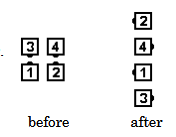

# Dixie Style to an Ocean Wave

### Starting formations
Facing Couples, Facing Tandems

### Command examples
#### Dixie Style to a Wave
#### Dixie Style to an Ocean Wave
#### Put the Ladies in the Lead, Dixie Style to a Wave (from normal Facing Couples)
#### Ladies Lead, Dixie Style to an Ocean Wave (from normal Facing Couples)
#### On a Double Track, Dixie Style (from a Double Pass Thru)
#### Boys Lead, Dixie Style to a Wave (from sashayed Facing Couples)

### Dance action
From Facing Couples: do half of a Half Sashay (that is, dancers slide inward until 
they form a Tandem, with the original right-hand dancer in front)
and Centers Right Pull By; all Left Touch a Quarter.

From Facing Tandems: Centers Right Pull By; all Left Touch a Quarter.

### Ending formation
Left-Hand Ocean Wave

>
> 
>

### Timing
6

### Styling
From Facing Couples, the left-hand dancers take a full step back and to the right.
This prepares for the Left Touch a Quarter while giving the right-hand dancers room to Right Pull By.
From Facing Tandems, the Trailers step slightly to the right to prepare for the Left Touch a Quarter.

### Comments
The [Ocean Wave Rule](../ms/ocean_wave_rule.md) applies to this call (from a Single 1/4 Tag).

From a Double Pass Thru, it is confusing to simply call Dixie Style to an Ocean Wave because of the following ambiguity: The Center Four dancers could do the call starting from Facing Couples, or each Tandem could do the call with the Tandem they are facing. The caller should clarify by using extra words before
“Dixie Style to a Wave” such as: “On a Double Track”, “Single File”, or
“Each Column of 4” if all 8 dancers should be involved, or “Center Four” if only the Centers are
active.

“Double Track” is used to describe the action when there are two side-by-side Facing Tandems
dancing separately along their own “Track”.

From a Normal Squared Set, “All 4 Ladies Lead, Dixie Style to a Wave” is an extended application
(and is likely to be called immediately after Four Ladies Chain). The Right Pull By is replaced
by Right-Hand Star 1/2, similar to Four Ladies Chain. After the Left Touch a Quarter, dancers
end in a Thar with men in the center. Callers should expect that this will need a workshop.

## Reverse Dixie Style to a Wave
Do half of a Reverse Half Sashay, Centers Left Pull By, all Touch a Quarter.

###### @ Copyright 1997, 2001-2026 by CALLERLAB Inc., The International Association of Square Dance Callers. Permission to reprint, republish, and create derivative works without royalty is hereby granted, provided this notice appears. Publication on the Internet of derivative works without royalty is hereby granted provided this notice appears. Permission to quote parts or all of this document without royalty is hereby granted, provided this notice is included. Information contained herein shall not be changed nor revised in any derivation or publication. 1994, 2000-2020 by CALLERLAB Inc., The International Association of Square Dance Callers. Permission to reprint, republish, and create derivative works without royalty is hereby granted, provided this notice appears. Publication on the Internet of derivative works without royalty is hereby granted provided this notice appears. Permission to quote parts or all of this document without royalty is hereby granted, provided this notice is included. Information contained herein shall not be changed nor revised in any derivation or publication.
