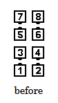
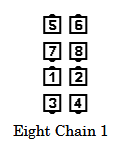
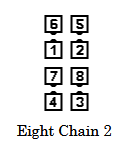
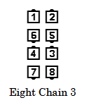
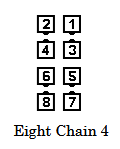

# Eight Chain Thru

### Starting formation

Eight Chain Thru

### Command examples

#### Eight Chain Thru
#### Eight Chain 3
#### Eight Chain 4
#### Eight Chain 1, Allemande Left

### Dance action
The dancers perform a sequence of actions as described below and always starting
at the top. If the call is “Eight Chain Thru” they do all eight of the actions. If the call is Eight
Chain (number), they do that number of actions.

Complete as many of these actions as appropriate:

- All Right Pull By (Eight Chain 1 has been completed)
- Centers Left Pull By while the ends Courtesy Turn (Eight Chain 2 has been completed)
- All Right Pull By (Eight Chain 3 has been completed)
- Centers Left Pull By while the ends Courtesy Turn (Eight Chain 4 has been completed)
- All Right Pull By (Eight Chain 5 has been completed)
- Centers Left Pull By while the ends Courtesy Turn (Eight Chain 6 has been completed)
- All Right Pull By (Eight Chain 7 has been completed)
- Centers Left Pull By while the ends Courtesy Turn (Eight Chain Thru has been completed)

Note that Eight Chain Thru is equal to Eight Chain 8.

### Ending formations
Eight Chain Thru ends in Eight Chain Thru

Eight Chain 1, 3, 5, etc. ends in Trade By

Eight Chain 2, 4, 6, etc. ends in Eight Chain Thru

>
> 
> 
> 
> 
> 
>

### Timing
Eight Chain Thru: 20

Eight Chain 1, 2, 3, etc.: each odd-numbered part: 2; each even-numbered part: 3 (for example, Eight Chain 3: 2+3+2 = 7)

### Styling
Same as Right And Left Thru. Dancers doing the Left Pull By in the center move slowly so their action takes the same time as the Courtesy Turn on the outside.

Each part of this call ends in an Eight Chain Thru or Trade By formation. Dancers should not drift into a circular formation as in Wrong Way Grand.

### Comment
The [Ocean Wave Rule](../ms/ocean_wave_rule.md) applies to  Eight Chain Thru and variations 1, 2, 3, etc.

###### @ Copyright 1997, 2001-2026 by CALLERLAB Inc., The International Association of Square Dance Callers. Permission to reprint, republish, and create derivative works without royalty is hereby granted, provided this notice appears. Publication on the Internet of derivative works without royalty is hereby granted provided this notice appears. Permission to quote parts or all of this document without royalty is hereby granted, provided this notice is included. Information contained herein shall not be changed nor revised in any derivation or publication. 1994, 2000-2020 by CALLERLAB Inc., The International Association of Square Dance Callers. Permission to reprint, republish, and create derivative works without royalty is hereby granted, provided this notice appears. Publication on the Internet of derivative works without royalty is hereby granted provided this notice appears. Permission to quote parts or all of this document without royalty is hereby granted, provided this notice is included. Information contained herein shall not be changed nor revised in any derivation or publication.
