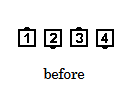
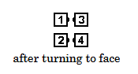

# Explode and Anything

### Starting formations
At Plus, only from a Four-Dancer Ocean Wave

### Dance action
Everyone releases handholds, steps forward and Turns 1/4 In (90 degrees) to face
the adjacent dancer, and does the (anything) call (for example, Right and Left Thru, Star Thru,
etc.).

>
> 
> 
>

### Timing
2 for the Explode portion

### Styling
In all Explode and (anything) applications, follow the styling suggestions for the
(anything) call used.

### Comments
Although “Explode and (anything)” and “(anything) and Roll” are each defined to
accompany an (anything) call, they are sometimes combined with each other. Here is the dance
action for this special case.

## Explode and Roll
Step forward, then Turn 1/4 In (90 degrees) to face the adjacent dancer and
Roll. From Parallel Waves, this call produces an Eight Chain Thru formation. From a Tidal
Wave, this call produces Facing Lines

###### @ Copyright 1997, 2001-2026 by CALLERLAB Inc., The International Association of Square Dance Callers. Permission to reprint, republish, and create derivative works without royalty is hereby granted, provided this notice appears. Publication on the Internet of derivative works without royalty is hereby granted provided this notice appears. Permission to quote parts or all of this document without royalty is hereby granted, provided this notice is included. Information contained herein shall not be changed nor revised in any derivation or publication. 1997, 2001-2025 by CALLERLAB Inc., The International Association of Square Dance Callers. Permission to reprint, republish, and create derivative works without royalty is hereby granted, provided this notice appears. Publication on the Internet of derivative works without royalty is hereby granted provided this notice appears. Permission to quote parts or all of this document without royalty is hereby granted, provided this notice is included. Information contained herein shall not be changed nor revised in any derivation or publication.
