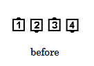
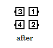

# Explode the Wave

### Starting formation
Only from a Four-Dancer Ocean Wave

### Dance action
Everyone releases handholds, steps forward and turns 1/4 in (90 degrees) to face the
adjacent dancer, and right hand [pulls by](../ms/pull_by.md) that person, to end as Couples Back-to-Back. 

### Ending formation
Back-to-Back Couples

>
> 
> 
>

### Timing
6

### Styling
A  handshake hold is used as dancers right hand pull by. For position orientation, hands are joined in a Couple handhold at the completion of the call.

###### @ Copyright 1997, 2001-2026 by CALLERLAB Inc., The International Association of Square Dance Callers. Permission to reprint, republish, and create derivative works without royalty is hereby granted, provided this notice appears. Publication on the Internet of derivative works without royalty is hereby granted provided this notice appears. Permission to quote parts or all of this document without royalty is hereby granted, provided this notice is included. Information contained herein shall not be changed nor revised in any derivation or publication. 1997, 2001-2025 by CALLERLAB Inc., The International Association of Square Dance Callers. Permission to reprint, republish, and create derivative works without royalty is hereby granted, provided this notice appears. Publication on the Internet of derivative works without royalty is hereby granted provided this notice appears. Permission to quote parts or all of this document without royalty is hereby granted, provided this notice is included. Information contained herein shall not be changed nor revised in any derivation or publication.
