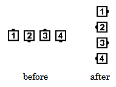

# Fan the Top

### Starting formations
Ocean Wave, Two-Faced Line, or Diamond

### Dance action
The Centers of the Line, Wave, or Diamond Turn 3/4 (270 degrees) while the Ends
(or Points, in the case of a Diamond) move forward in a 1/4 (90-
degree) circle.

### Ending formations
An Ocean Wave ends in an Ocean Wave. A
Two-Faced Line ends in a Two-Faced Line. A Diamond ends in a
Diamond. The ending formation is at right angles to the starting
formation. Centers remain Centers, Ends remain Ends, and Points
remain Points.

>
> 
> 

### Timing
4

### Styling
Center dancers use hands-up position and styling similar to that of Swing Thru. End
dancers' arms are in natural dance position and hands are ready to assume appropriate position
for the next call.

### Comment
The Facing Couples Rule applies to Fan the Top.

###### @ Copyright 1997, 2001-2026 by CALLERLAB Inc., The International Association of Square Dance Callers. Permission to reprint, republish, and create derivative works without royalty is hereby granted, provided this notice appears. Publication on the Internet of derivative works without royalty is hereby granted provided this notice appears. Permission to quote parts or all of this document without royalty is hereby granted, provided this notice is included. Information contained herein shall not be changed nor revised in any derivation or publication. 1997, 2001-2025 by CALLERLAB Inc., The International Association of Square Dance Callers. Permission to reprint, republish, and create derivative works without royalty is hereby granted, provided this notice appears. Publication on the Internet of derivative works without royalty is hereby granted provided this notice appears. Permission to quote parts or all of this document without royalty is hereby granted, provided this notice is included. Information contained herein shall not be changed nor revised in any derivation or publication.
