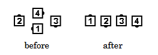
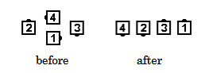

# Flip the Diamond

### Starting formations
Any Diamond

### Dance action
The Centers of the Diamond do a Diamond Circulate to the next position in their
Diamond, while the Points Run (“Flip” 180 degrees) into the nearest center position and join
hands to become the Centers of the forming Wave or Line. When “Flipping” a Facing Diamond,
the Points always take the inside path, and the Centers always take the outside path.

### Ending formations
A Right-Hand Diamond ends in a Right-Hand Wave. A Left-Hand Diamond
ends in a Left-Hand Wave. A Facing Diamond ends in a Two-Faced Line.

>
> 
> 
>

### Timing
3

### Styling
From a Right or Left-Hand Diamond, all dancers blend into hands up position as
appropriate for an Ocean Wave. If the starting formation is a Facing Diamond, all dancers blend
into a Couple handhold.

###### @ Copyright 1997, 2001-2026 by CALLERLAB Inc., The International Association of Square Dance Callers. Permission to reprint, republish, and create derivative works without royalty is hereby granted, provided this notice appears. Publication on the Internet of derivative works without royalty is hereby granted provided this notice appears. Permission to quote parts or all of this document without royalty is hereby granted, provided this notice is included. Information contained herein shall not be changed nor revised in any derivation or publication. 1997, 2001-2025 by CALLERLAB Inc., The International Association of Square Dance Callers. Permission to reprint, republish, and create derivative works without royalty is hereby granted, provided this notice appears. Publication on the Internet of derivative works without royalty is hereby granted provided this notice appears. Permission to quote parts or all of this document without royalty is hereby granted, provided this notice is included. Information contained herein shall not be changed nor revised in any derivation or publication.
