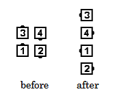
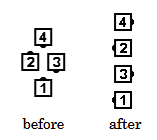

# Follow Your Neighbor

### Starting formations
Right-Hand or Left-Hand Box, Single 1/4 Tag

### Dance action
From a Right-Hand or Left-Hand Box: While the Trailers Extend and Arm Turn
3/4 (270 degrees), the Leaders move forward in a tight 3/4 (270-degree) circle toward their
Partner to finish as Ends of an Ocean Wave. Follow Your Neighbor cannot be fractionalized.
From a Single 1/4 Tag: All dancers do the Trailers part (Extend and Arm Turn 3/4).

### Ending formations
From a Right-Hand Box, Follow Your Neighbor ends in a Left-Hand Wave.  
From a Left-Hand Box, Follow Your Neighbor ends in a Right-Hand Wave.  
From a Right-Hand Single 1/4 Tag, Follow Your Neighbor ends in a Right-Hand Wave.  
From a Left-Hand Single 1/4 Tag, Follow Your Neighbor ends in a Left-Hand Wave.

>
> 
> 
>

### Timing
6

### Styling
Those who Arm Turn 3/4 use a forearm grip, blending at the end of the call into the usual
handhold for an Ocean Wave.

###### @ Copyright 1997, 2001-2026 by CALLERLAB Inc., The International Association of Square Dance Callers. Permission to reprint, republish, and create derivative works without royalty is hereby granted, provided this notice appears. Publication on the Internet of derivative works without royalty is hereby granted provided this notice appears. Permission to quote parts or all of this document without royalty is hereby granted, provided this notice is included. Information contained herein shall not be changed nor revised in any derivation or publication. 1997, 2001-2025 by CALLERLAB Inc., The International Association of Square Dance Callers. Permission to reprint, republish, and create derivative works without royalty is hereby granted, provided this notice appears. Publication on the Internet of derivative works without royalty is hereby granted provided this notice appears. Permission to quote parts or all of this document without royalty is hereby granted, provided this notice is included. Information contained herein shall not be changed nor revised in any derivation or publication.
