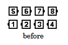
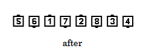

# Grand Quarter Thru 

Timing: 6

### Starting formations
From Right-Hand Columns (of 6 or 8).

### Dance action
***Those who can Turn 1/4 (90 degrees) by the Right***,
then ***those who can Turn 1/2 (180 degrees) by the Left***.

### Ending formations
Right-Hand Columns end in a Right-Hand Tidal Wave.

>
> 
> 
>

Grand Quarter Thru is defined to begin with a Right Turn. If the caller wants the action to begin
with a Left Turn, then the command to use is “Grand Left Quarter Thru” or “Grand Left One-Quarter Thru”.

### Timing
6

### Styling
For all members in this family the styling is the same as for Swing Thru. That is, use
Hands Up throughout the call. The first part of the call blends smoothly into the second part.

## Grand Left Quarter Thru
***Those who can Turn 1/4 by the Left***,
then ***those who can Turn 1/2 by the Right***. Left-Hand Columns end in a Left-Hand Tidal Wave.

### Comment
There must be at least one dancer who can do both parts of the call. The call is not
proper from Magic Columns (Columns containing Mini-Waves of one handedness on the outside
and of the other handedness in the center).

###### @ Copyright 1997, 2001-2026 by CALLERLAB Inc., The International Association of Square Dance Callers. Permission to reprint, republish, and create derivative works without royalty is hereby granted, provided this notice appears. Publication on the Internet of derivative works without royalty is hereby granted provided this notice appears. Permission to quote parts or all of this document without royalty is hereby granted, provided this notice is included. Information contained herein shall not be changed nor revised in any derivation or publication. 1982, 1986-1988, 1995, 2001-2025. Bill Davis, John Sybalsky, and CALLERLAB Inc., The International Association of Square Dance Callers. Permission to reprint, republish, and create derivative works without royalty is hereby granted, provided this notice appears. Publication on the Internet of derivative works without royalty is hereby granted provided this notice appears. Permission to quote parts or all of this document without royalty is hereby granted, provided this notice is included. Information contained herein shall not be changed nor revised in any derivation or publication.

<!-- Parts
GrandQuarterThru1
GrandQuarterThru2
GrandLeftQuarterThru1
GrandLeftQuarterThru2
-->