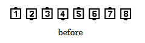
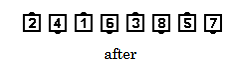

# Grand Swing Thru

### Starting formation
Tidal Wave, Ocean Wave of Six Dancers. 

### Dance action
***Those who can Turn 1/2 by the Right***,
***then those who can Turn 1/2 by the Left***.

>
> 
> 
>

As for Swing Thru, Grand Swing Thru is defined to begin with a Turn by the Right. If the caller
wants the action to begin with a Turn by the Left, then the command to use is “Grand Left
Swing Thru” or “Left Grand Swing Thru”

## Grand Left Swing Thru
***Those who can Turn 1/2 by the Left,***
***then those who can Turn 1/2 by the Right***.

### Ending formations
Same as the starting formation

### Timing
6

### Styling
Use Hands Up throughout the call. The first part of the call blends smoothly into the
second part.

### Comment
The Facing Couples Rule applies to Grand Swing Thru and Grand Left Swing Thru.

###### @ Copyright 1997, 2001-2026 by CALLERLAB Inc., The International Association of Square Dance Callers. Permission to reprint, republish, and create derivative works without royalty is hereby granted, provided this notice appears. Publication on the Internet of derivative works without royalty is hereby granted provided this notice appears. Permission to quote parts or all of this document without royalty is hereby granted, provided this notice is included. Information contained herein shall not be changed nor revised in any derivation or publication. 1997, 2001-2025 by CALLERLAB Inc., The International Association of Square Dance Callers. Permission to reprint, republish, and create derivative works without royalty is hereby granted, provided this notice appears. Publication on the Internet of derivative works without royalty is hereby granted provided this notice appears. Permission to quote parts or all of this document without royalty is hereby granted, provided this notice is included. Information contained herein shall not be changed nor revised in any derivation or publication.

<!-- Parts
GrandSwingThru1
GrandSwingThru2
GrandLeftSwingThru1
GrandLeftSwingThru2
-->