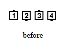
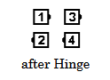
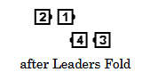
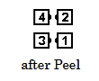

# Linear Cycle

### Starting formation
General Line (At Plus, this call is restricted to starting from a Wave only.)

### Dance action
This is a three-part call:
1. The End and adjacent Center dancers Hinge.
2. In one blended action, the Leaders [Fold](../ms/fold.md) (behind the Trailers) as the Trailers begin a [Double Pass Thru](../ms/double_pass_thru.md) (or a Left Double Pass Thru if both Mini-Waves were Left-Handed before the Fold).
3. As the dancers complete the Double Pass Thru, each pair of Tandem dancers [Peel](peel_off.md) to their right or left depending on the handedness of their Mini-Wave before the Fold. 

### Ending formation
Facing Couples.

>
> 
> 
> 
> 
>

### Timing
8-10

### Styling
The first part is performed using the standard styling for the Hinge. Then dancers drop hands and dance with arms in natural dance position until reconnecting in a Couple handhold as the call is being completed.

###### @ Copyright 1997, 2001-2026 by CALLERLAB Inc., The International Association of Square Dance Callers. Permission to reprint, republish, and create derivative works without royalty is hereby granted, provided this notice appears. Publication on the Internet of derivative works without royalty is hereby granted provided this notice appears. Permission to quote parts or all of this document without royalty is hereby granted, provided this notice is included. Information contained herein shall not be changed nor revised in any derivation or publication. 1997, 2001-2025 by CALLERLAB Inc., The International Association of Square Dance Callers. Permission to reprint, republish, and create derivative works without royalty is hereby granted, provided this notice appears. Publication on the Internet of derivative works without royalty is hereby granted provided this notice appears. Permission to quote parts or all of this document without royalty is hereby granted, provided this notice is included. Information contained herein shall not be changed nor revised in any derivation or publicatio