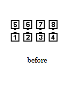
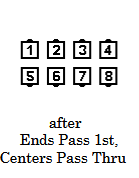
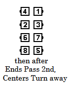
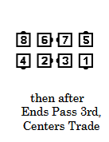
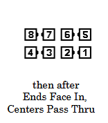

# Load the Boat

### Starting formation
Lines of Four, with Centers facing in, and
the Ends of each Line facing the same (In or Out) direction. 

### Dance action
The End dancers move forward around the outside, passing right shoulders with three
moving End dancers, and turn 1/4 in to stand beside the third person
passed, facing the center of the set as a Couple. Simultaneously, the Center Four dancers
***[Pass Thru](../ms/pass_thru.md),***
***Turn their backs to their momentary partners,***
***[Partner Trade](../ms/trade.md) with their **new** ***
Partners, and
***[Pass Thru](../ms/pass_thru.md).***

### Ending formations
Facing Lines end in Eight Chain Thru formation. Inverted Lines with Ends
Facing Out ends in a 2×4 T-Bone with the Centers Facing Out and the Ends Facing towards the
Centers.

>
> 
> 
> 
> 
> 
>

### Timing
12

### Styling
The End dancers, while moving on the outside, leave enough room for the Center dancers to work comfortably. Arms are held in  natural dance position throughout the action, blending into the appropriate hand position for the next call.

### Comment
The Ocean Wave Rule applies to Load the Boat

###### @ Copyright 1997, 2001-2026 by CALLERLAB Inc., The International Association of Square Dance Callers. Permission to reprint, republish, and create derivative works without royalty is hereby granted, provided this notice appears. Publication on the Internet of derivative works without royalty is hereby granted provided this notice appears. Permission to quote parts or all of this document without royalty is hereby granted, provided this notice is included. Information contained herein shall not be changed nor revised in any derivation or publication. 1997, 2001-2025 by CALLERLAB Inc., The International Association of Square Dance Callers. Permission to reprint, republish, and create derivative works without royalty is hereby granted, provided this notice appears. Publication on the Internet of derivative works without royalty is hereby granted provided this notice appears. Permission to quote parts or all of this document without royalty is hereby granted, provided this notice is included. Information contained herein shall not be changed nor revised in any derivation or publication.
