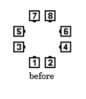
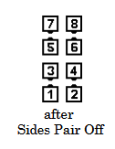
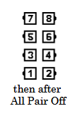
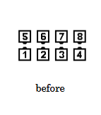
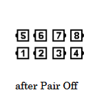

# Pair Off

### Starting formation
At Plus, only from Facing Dancers, neither of whom is facing the flagpole
center of the set. (“Flagpole center” designates
the geometric center point of the set.)

### Dance action
Dancers face out to end as a Couple.
From a Static Square, the designated dancers
will first step forward into the center

>
> 
> 
> 
> 
> 
> 
> 

### Ending formation
Couple

### Timing
2, SS 4

###### @ Copyright 1997, 2001-2026 by CALLERLAB Inc., The International Association of Square Dance Callers. Permission to reprint, republish, and create derivative works without royalty is hereby granted, provided this notice appears. Publication on the Internet of derivative works without royalty is hereby granted provided this notice appears. Permission to quote parts or all of this document without royalty is hereby granted, provided this notice is included. Information contained herein shall not be changed nor revised in any derivation or publication. 1982, 1986-1988, 1995, 2001-2025. Bill Davis, John Sybalsky, and CALLERLAB Inc., The International Association of Square Dance Callers. Permission to reprint, republish, and create derivative works without royalty is hereby granted, provided this notice appears. Publication on the Internet of derivative works without royalty is hereby granted provided this notice appears. Permission to quote parts or all of this document without royalty is hereby granted, provided this notice is included. Information contained herein shall not be changed nor revised in any derivation or publication.
