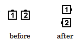

# Partner Hinge 

### Starting formation
Only from a Couple

### Dance action
Half Partner Trade, finishing in a Right-Hand Mini-Wave
at right angles to the original Couple, with the new handhold centered on
the original handhold.

### Ending formation
Right-Hand Mini-Wave

>
> 
> 

### Timing
2

## Left Partner Hinge
The “Left” changes the right-shoulder pass in Partner Trade to a 
left-shoulder pass, so stopping at the halfway point ends
in a Left-Hand Mini-Wave.

### Comment
The command “Hinge” can be used for either Single Hinge or Partner Hinge.

###### @ Copyright 1997, 2001-2026 by CALLERLAB Inc., The International Association of Square Dance Callers. Permission to reprint, republish, and create derivative works without royalty is hereby granted, provided this notice appears. Publication on the Internet of derivative works without royalty is hereby granted provided this notice appears. Permission to quote parts or all of this document without royalty is hereby granted, provided this notice is included. Information contained herein shall not be changed nor revised in any derivation or publication. 1982, 1986-1988, 1995, 2001-2025. Bill Davis, John Sybalsky, and CALLERLAB Inc., The International Association of Square Dance Callers. Permission to reprint, republish, and create derivative works without royalty is hereby granted, provided this notice appears. Publication on the Internet of derivative works without royalty is hereby granted provided this notice appears. Permission to quote parts or all of this document without royalty is hereby granted, provided this notice is included. Information contained herein shall not be changed nor revised in any derivation or publication.
