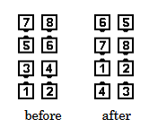

# Pass to the Center

### Starting formation
Eight Chain Thru

### Dance action
Pass Thru. Those looking out of the square Partner Trade.

### Ending formation
Double Pass Thru formation

>
> 
>

### Timing
Dancers who finish in the center: 2.   
Dancers who finish on the ends: 6.

### Styling
Same styling as Pass Thru and Partner Trade.

### Comments
The [Ocean Wave Rule](../ms/ocean_wave_rule.md) applies to Pass to the Center.

This call is not proper from Left-Hand Ocean Waves.
However, Left Pass to the Center is
proper from an Eight Chain Thru formation or from
Left-Hand Ocean Waves. It is defined as
Left Pass Thru, then those looking out of the square Left Partner Trade.

On the Pass Thru, some dancers should be coming into the center
and other dancers should be heading towards the outside.
This call is not proper from Facing Lines.

###### @ Copyright 1997, 2001-2026 by CALLERLAB Inc., The International Association of Square Dance Callers. Permission to reprint, republish, and create derivative works without royalty is hereby granted, provided this notice appears. Publication on the Internet of derivative works without royalty is hereby granted provided this notice appears. Permission to quote parts or all of this document without royalty is hereby granted, provided this notice is included. Information contained herein shall not be changed nor revised in any derivation or publication. 1994, 2000-2020 by CALLERLAB Inc., The International Association of Square Dance Callers. Permission to reprint, republish, and create derivative works without royalty is hereby granted, provided this notice appears. Publication on the Internet of derivative works without royalty is hereby granted provided this notice appears. Permission to quote parts or all of this document without royalty is hereby granted, provided this notice is included. Information contained herein shall not be changed nor revised in any derivation or publication.
