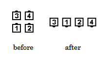
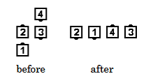

# Peel Off

### Starting formation
Tandem Couples, Box Circulate, or Z formation.

### Dance action
Lead dancers walk in an approximate semicircle, away from the center of the starting formation, to
become the Ends of a Four-Dancer Line. Trailing dancers step forward as necessary to become Centers of
the same line and U-Turn Back, turning away from the center of the starting formation. All dancers end
in a Four-Dancer Line. Each dancer will have turned 1/2 (180 degrees) to end facing the opposite
direction from which they started. 

### Ending fomation
Peel Off from Tandem Couples ends in a One-Faced Line.
Peel Off from a Right-Hand or Left-Hand Box or a Z ends in a Two-Faced Line (opposite hand).

>
> 
> 
>

### Timing
4

### Comments
Everyone can [Roll](anything_and_roll.md) after a Peel Off. 
Dancers move in a smooth, continuous motion that cannot
be fractionalized. The center of the ending formation is the same 
as the center of the starting formation.

Two dancers who form a Tandem and have a center to work away from can Peel Off as if in a
Right-Hand or Left-Hand Box (for example, the Ends of Waves or the Points of Diamonds). They
finish as a Couple on a line midway between the original lead and trailing positions.

### Styling
Arms should be held in  natural dance position and ready
to assume appropriate position for the next call. 
It is important that Lead dancers move slightly forward before starting the "peeling" motion.

###### @ Copyright 1997, 2001-2026 by CALLERLAB Inc., The International Association of Square Dance Callers. Permission to reprint, republish, and create derivative works without royalty is hereby granted, provided this notice appears. Publication on the Internet of derivative works without royalty is hereby granted provided this notice appears. Permission to quote parts or all of this document without royalty is hereby granted, provided this notice is included. Information contained herein shall not be changed nor revised in any derivation or publication. 1997, 2001-2025 by CALLERLAB Inc., The International Association of Square Dance Callers. Permission to reprint, republish, and create derivative works without royalty is hereby granted, provided this notice appears. Publication on the Internet of derivative works without royalty is hereby granted provided this notice appears. Permission to quote parts or all of this document without royalty is hereby granted, provided this notice is included. Information contained herein shall not be changed nor revised in any derivation or publication.
