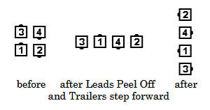
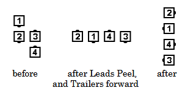

# Peel the Top

### Starting formation
Right-Hand or Left-Hand Box, or Z formation

### Dance action
The Lead dancers [Peel Off](peel_off.md) as the Trailing dancers
step straight forward as necessary to take
adjacent hands; everyone then does a [Fan the Top](fan_the_top.md). 

### Ending formations
A Right-Hand Box or Z formation ends in a Left-Hand Wave.  
A Left-Hand Box or Z formation ends in a Right-Hand Wave.

>
> 
> 
>

### Timing
6

### Styling
Lead dancers have arms in  natural dance position and adjust hands to appropriate position for next call. It is important that dancers move slightly forward before starting the "peeling" motion. Trailing dancers use  hands up position and styling as in Swing Thru.

###### @ Copyright 1997, 2001-2026 by CALLERLAB Inc., The International Association of Square Dance Callers. Permission to reprint, republish, and create derivative works without royalty is hereby granted, provided this notice appears. Publication on the Internet of derivative works without royalty is hereby granted provided this notice appears. Permission to quote parts or all of this document without royalty is hereby granted, provided this notice is included. Information contained herein shall not be changed nor revised in any derivation or publication. 1997, 2001-2025 by CALLERLAB Inc., The International Association of Square Dance Callers. Permission to reprint, republish, and create derivative works without royalty is hereby granted, provided this notice appears. Publication on the Internet of derivative works without royalty is hereby granted provided this notice appears. Permission to quote parts or all of this document without royalty is hereby granted, provided this notice is included. Information contained herein shall not be changed nor revised in any derivation or publication.
