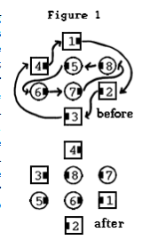
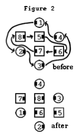

# Ping Pong Circulate

### Starting formation
1/4 Tag. 

### Dance action
The movement starts on 1/4 Tag spots and ends on those same spots. Each dancer
moves forward one position along one of two circulate paths. These paths both go around the
center of the formation and do not cross each other.

The “outside path” includes the positions of the Ends of the Center Wave and of the Outside
dancer on each side who is nearest to and behind those Wave Ends. The “inside path” includes
the positions of the Very Centers and of the Outside dancer on each side who is directly behind
a Very Center. These paths are illustrated at the top of Figure 1 for the case of a Right-Hand 1/4
Tag formation and at the top of Figure 2 for the case of a Left-Hand 1/4 Tag formation

In the typical case of a Right-Hand 1/4 Tag
starting formation, each Wave End moves
forward along the outside path, going wide
around one Outside spot and Turning to the Right
180 degrees to end facing in on the farther
Outside spot, while each Outside dancer on the
outside path moves diagonally forward and
outward, without turning, to become a Wave End.
Each Very Center moves forward along the inside
path, going diagonally Left and blending into a
tight 180-degree Left Turn to end facing in on the
farther Outside spot, while each Outside dancer
on the inside path moves straight forward to
become a Very Center.

From a Left-Hand 1/4 Tag formation, all movements are the same except that Wave Ends turn
to the Left and Very Centers go diagonally Right and Turn to the Right.

> 
> 
> 
>

### Timing
6

### Styling
Styling is the same as previously described for [Circulate](../ms/circulate.md).
Dancers in center use Ocean Wave styling.
Outside dancers join hands in Couple handhold.

### Comment
The inside and outside paths are independent of each other. Therefore, it is possible
for only those on the outside path (dancers numbered 1, 2, 3, and 4 in Figures 1 and 2) to Ping
Pong Circulate or only those on the inside path (dancers numbered 5, 6, 7, and 8 in Figures 1
and 2) to Ping Pong Circulate.

###### @ Copyright 1997, 2001-2026 by CALLERLAB Inc., The International Association of Square Dance Callers. Permission to reprint, republish, and create derivative works without royalty is hereby granted, provided this notice appears. Publication on the Internet of derivative works without royalty is hereby granted provided this notice appears. Permission to quote parts or all of this document without royalty is hereby granted, provided this notice is included. Information contained herein shall not be changed nor revised in any derivation or publication. 1997, 2001-2025 by CALLERLAB Inc., The International Association of Square Dance Callers. Permission to reprint, republish, and create derivative works without royalty is hereby granted, provided this notice appears. Publication on the Internet of derivative works without royalty is hereby granted provided this notice appears. Permission to quote parts or all of this document without royalty is hereby granted, provided this notice is included. Information contained herein shall not be changed nor revised in any derivation or publication.
