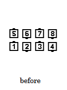
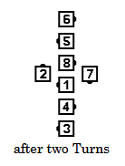
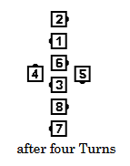
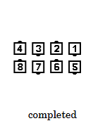

# Relay the Deucey

### Starting formation
Parallel Ocean Waves.

### Dance action
All Circulates in this definition refer to the **original**
Circulate path established by the Ends of the original Ocean
Waves. No dancer ever stops moving during this call; the pauses
written into the definition (that is, the action described as
"Half-Circulate") are there for clarity of description
and for teaching purposes only.

***Each end and the adjacent center dancer turn one-half (180°).***
***The new Centers of each Ocean Wave turn 3/4
(270 degrees), while the others Half Circulate, forming a
Six-Person Wave and two lonesome dancers.***
***The 3 Pairs in the Wave of 6 each Turn 1/2, while the others Half-Circulate.***
***The 2 Pairs in the Center 4 of the Wave of 6 each Turn 1/2, while the Other Four
dancers Half Circulate.***
***The 3 Pairs in the Wave of 6 each Turn 1/2, while the Others Half-Circulate.***
***Finally, the 2 Pairs in the Center 4 of the Wave each Turn 3/4 (becoming the Centers
of the new Waves), while the outside 4 Half Circulate to become the Ends of the final Waves.***

>
> 
> 
> 
> 
>

### Ending formations
Parallel Ocean Waves with the same handedness and in the same location
as the original Waves.

### Timing
20

### Styling
Basic swing thru
styling is utilized for turning movements within the Ocean Wave
formations. Circulating dancers do the circulate action with arms in
natural dance position,
blending to hands up Ocean Wave formation at the conclusion of the call.

### Comments
The Facing Couples Rule applies to Relay the Deucey.

It is useful for both dancers and callers to know that the overall effect of Relay the Deucey is to
rotate the entire starting formation by 180 degrees.

###### @ Copyright 1997, 2001-2026 by CALLERLAB Inc., The International Association of Square Dance Callers. Permission to reprint, republish, and create derivative works without royalty is hereby granted, provided this notice appears. Publication on the Internet of derivative works without royalty is hereby granted provided this notice appears. Permission to quote parts or all of this document without royalty is hereby granted, provided this notice is included. Information contained herein shall not be changed nor revised in any derivation or publication. 1997, 2001-2025 by CALLERLAB Inc., The International Association of Square Dance Callers. Permission to reprint, republish, and create derivative works without royalty is hereby granted, provided this notice appears. Publication on the Internet of derivative works without royalty is hereby granted provided this notice appears. Permission to quote parts or all of this document without royalty is hereby granted, provided this notice is included. Information contained herein shall not be changed nor revised in any derivation or publication.
