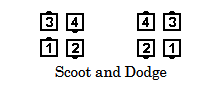
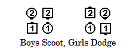

# Scoot and Dodge

### Starting formations
Only from a Right-Hand Box, Left-Hand Box, or Facing Couples

### Command examples
#### Scoot and Dodge
#### Right and Left Thru, Girls Scoot Back, Boys Dodge (from Facing Normal Couples)
#### Boys Scoot, Girls Dodge

### Dance action
Some dancers do their part of Scoot Back (“Scoot”) to take the position of the dancer
beside them, and other dancers, without changing facing direction, move sideways (“Dodge”) into
the adjacent spot.

From a Right-Hand or Left-Hand Box, the Trailers “Scoot” and Leaders “Dodge”.
From Facing Couples, callers must designate which dancers “Scoot” and which dancers “Dodge”.

### Ending formations
Back-to-Back Couples, Right-Hand Box, or Left-Hand Box

>
> 
> 
> 

### Timing
8

### Comment
It is mandatory from Facing Couples to designate two of the dancers to do their part
of Scoot Back while the other two dancers Dodge. For example, “Girls Scoot Back, Boys Dodge”
or “Original Heads Scoot Back, others Dodge”. The result will be either a Right-Hand Box or a
Left-Hand Box.

###### @ Copyright 1997, 2001-2026 by CALLERLAB Inc., The International Association of Square Dance Callers. Permission to reprint, republish, and create derivative works without royalty is hereby granted, provided this notice appears. Publication on the Internet of derivative works without royalty is hereby granted provided this notice appears. Permission to quote parts or all of this document without royalty is hereby granted, provided this notice is included. Information contained herein shall not be changed nor revised in any derivation or publication. 1982, 1986-1988, 1995, 2001-2025. Bill Davis, John Sybalsky, and CALLERLAB Inc., The International Association of Square Dance Callers. Permission to reprint, republish, and create derivative works without royalty is hereby granted, provided this notice appears. Publication on the Internet of derivative works without royalty is hereby granted provided this notice appears. Permission to quote parts or all of this document without royalty is hereby granted, provided this notice is included. Information contained herein shall not be changed nor revised in any derivation or publication.
