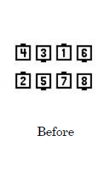
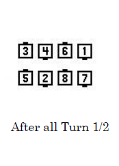
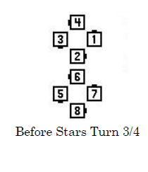
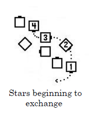
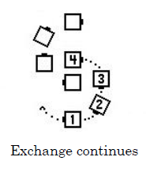
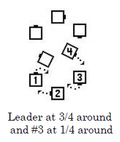
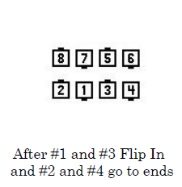

# Spin Chain & Exchange the Gears

Starting formation: Ocean Waves

***Each end and adjacent center turn 1/2.***
***New centers Turn 3/4 to form a center
Ocean Wave and the ends Flip In (180 degree inward turn similar to Ends Run).***
***Very Centers Turn 1/2.***
***Each half of the square forms a four-hand Star (a “gear”) and turns it 3/4.***

> 
> 
> 
> 
> 
> 

***Each Very Center dancer (one is #1 in the diagram)
leads those following them in their star (#2, #3 and #4)
along a circular path around the outside of the other star
(the “exchange”).
When #1 has gone 3/4 around and #3 has gone 1/4 around,
dancers #1 and #3 Flip In to join hands and become centers of a wave
while dancers #2 and #4 continue to move forward along the circular path
to join their inside hand with the dancer ahead to become ends of the wave.***
The call ends in waves with the same handedness and
in the same location as the original waves.

> 
> 
> 
> 
> 
> 

STYLING: Ocean wave and star turns use standard styling.

As the Centers Turn 3/4 at the beginning of the call,
the other dancers pause slightly and then, as they Flip In,
they bring the other hand up to immediately join the forming star.

While turning the star and exchanging,
each group of four dancers are following a smooth S-like path.
The exchange and formation of the waves is one continuous action.
Ocean wave and star turns use standard styling. As each star forms
(before turning the star), the dancer who will be leading the exchange
usually raises the outside hand to indicate "follow me".
That hand is held up for the star turn and through the exchange,
and can be smoothly joined with the inside hand of the following dancer
when forming the ending wave.

TIMING: 26

COMMENTS: The Facing Couples Rule applies to this call.

The 3/4 fraction to turn the star can be modified by the caller,
in which case a different dancer will be #1 and lead the exchange.

###### @ Copyright 1997, 2001-2021 by CALLERLAB Inc., The International Association of Square Dance Callers. Permission to reprint, republish, and create derivative works without royalty is hereby granted, provided this notice appears. Publication on the Internet of derivative works without royalty is hereby granted provided this notice appears. Permission to quote parts or all of this document without royalty is hereby granted, provided this notice is included. Information contained herein shall not be changed nor revised in any derivation or publication.
