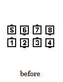
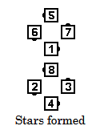
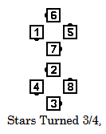
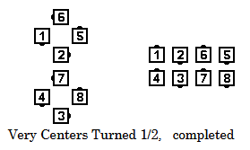

# Spin Chain the Gears

### Starting formations
Parallel Ocean Waves. 

### Dance Action
***Each End and the adjacent Center Turn 1/2 (180 degrees).***
***New Centers Turn 3/4 (270 degrees) to form a center Ocean Wave
and the Ends Flip In (180-degree inward turn similar to Ends Run).*** 
***Very Centers Turn 1/2.*** 
***Each half of the square forms a four-hand Star (a “gear”)
and turns it 3/4.***
***Very Centers Turn 1/2***
***Those in the center Ocean Wave Turn 3/4
while the other four dancers Flip Out
(180-degree outward Turn similar to Centers Run).***

### Ending formations
Parallel Ocean Waves with the same handedness and in the same location
as the original Waves.

>
> 
> 
> 
> 
> 

### Timing
24

### Styling
Ocean Wave and Star Turns use standard styling.

As the Centers Turn 3/4 at the beginning of the call,
the other dancers pause slightly and then,
as they Flip In, they bring the other hand up
to immediately join the forming star.

### Comments
The [Facing Couples Rule](../ms/facing_couples_rule.md) applies to Spin Chain the Gears

The 3/4 fraction to Turn the Star can be modified by the caller,
in which case different dancers
will be the Very Centers for the following Turn 1/2.

###### @ Copyright 1997, 2001-2026 by CALLERLAB Inc., The International Association of Square Dance Callers. Permission to reprint, republish, and create derivative works without royalty is hereby granted, provided this notice appears. Publication on the Internet of derivative works without royalty is hereby granted provided this notice appears. Permission to quote parts or all of this document without royalty is hereby granted, provided this notice is included. Information contained herein shall not be changed nor revised in any derivation or publication. 1997, 2001-2025 by CALLERLAB Inc., The International Association of Square Dance Callers. Permission to reprint, republish, and create derivative works without royalty is hereby granted, provided this notice appears. Publication on the Internet of derivative works without royalty is hereby granted provided this notice appears. Permission to quote parts or all of this document without royalty is hereby granted, provided this notice is included. Information contained herein shall not be changed nor revised in any derivation or publication.
