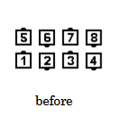
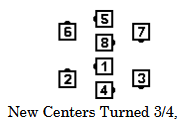
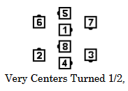
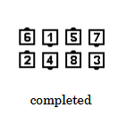

# Spin Chain Thru

### Starting formation
Parallel Ocean Waves

### Dance action
***Each end and adjacent Center Turn 1/2 (180 degrees)***.
***New Centers Turn 3/4 (270 degrees) to form a center Ocean Wave***. 
***Very Centers Turn 1/2***.
***In the center Ocean Wave, each End and adjacent Center Turn 3/4***.

### Ending formation
Parallel Ocean Waves with the same handedness and in the same location
as the original Waves.

>
> 
> 
> 
> 
>

### Timing
resulting Ends, 3; resulting Centers, 16

### Styling
Use same styling as in Swing Thru. The resulting Ends stand still as the Centers finish the call.

### Comments
The [Facing Couples Rule](../ms/facing_couples_rule.md) applies to Spin Chain Thru.

While the new Centers are finishing the call,
the resulting Ends may be given another call
(for example, Spin Chain Thru; Ends Circulate Twice).

Spin Chain Thru can be danced as "All Turn 1/2.
Those who meet Turn 3/4. Those who meet Turn 1/2. Those
who meet Turn 3/4".
With this in mind, some callers use Spin Chain Thru
from other formations as a gimmick
(see "Additional Detail: Commands: Gimmicks").
When using this gimmick, callers must indicate which Pairs
of dancers begin the call.
For example, if the staring formation is an Alamo Ring,
"Start with the right hand, Spin Chain Thru."

###### @ Copyright 1997, 2001-2026 by CALLERLAB Inc., The International Association of Square Dance Callers. Permission to reprint, republish, and create derivative works without royalty is hereby granted, provided this notice appears. Publication on the Internet of derivative works without royalty is hereby granted provided this notice appears. Permission to quote parts or all of this document without royalty is hereby granted, provided this notice is included. Information contained herein shall not be changed nor revised in any derivation or publication. 1994, 2000-2020 by CALLERLAB Inc., The International Association of Square Dance Callers. Permission to reprint, republish, and create derivative works without royalty is hereby granted, provided this notice appears. Publication on the Internet of derivative works without royalty is hereby granted provided this notice appears. Permission to quote parts or all of this document without royalty is hereby granted, provided this notice is included. Information contained herein shall not be changed nor revised in any derivation or publication.
