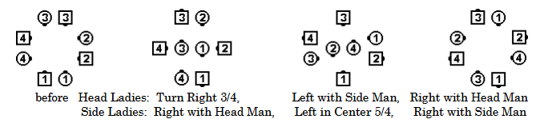
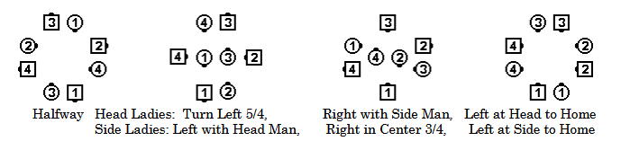

# Teacup Chain

### Starting formation
Static Square, or proceeding from everyone
doing a [Left Arm Turn](turn_thru.md) with partner. 

### Dance action
The caller will specify two Ladies to move to the center at the start of the call,
for example, "Head Ladies center for a Teacup Chain". For the rest of the definition,
these two Ladies will be called the "specified Ladies". 

***The specified Ladies (both Head Ladies or both Side Ladies) move to the center and
[Star Right](../ms/star.md) three-quarters to meet their Corners for a
[Left Arm Turn](turn_thru.md). At the same time, the other two Ladies move to the right
around the perimeter of the square to their Corners,
and do a [Right Arm Turn](turn_thru.md).***

***Following the Arm Turns, the specified Ladies move around the perimeter of the square
to their new Corners for a Right Arm Turn, while the other Ladies go to the center and
[Star Left](../ms/star.md) once and a quarter (that is, tive-quarters) 
to meet their new Corners for a Right Arm Turn.*** 

***The specified Ladies then move to the center and Star Left once and a quarter to their
new Corners for a Right Arm Turn, while the other Ladies move to their new Corners (around
the perimeter of the square) for a Left Arm Turn.*** 

***Finally, the specified Ladies move to their new corners
(their original Partners) for either a [Courtesy Turn](../ms/courtesy_turn.md)
or a Left Arm Turn leading into the next command, while the other
Ladies move to the center and Star Right three-quarters to meet their new Corners (their
original Partners) for either a Courtesy Turn or a Left Arm Turn leading into the next
command. Everyone finishes with his/her original Partner.*** 

The Men can dance the part described above for the Ladies, while the Ladies dance the part
described above for the Men. The starting formation is a Static Square with all Couples 
Half-Sashayed, or proceeding from everyone doing a Left Arm Turn with their Partner. The command
is “**Head/Side Men center for a Teacup Chain**”.

### Ending formations
Static Square or blending into the next command

>
> 
> 
> 

### Timing
32

### Styling
Center dancers turning in star patterns use hands up styling. All turns with outside
dancers are forearm turns. When not leading into another command, a Courtesy Turn, as
previously described, is used at the conclusion of the call. Outside dancers (usually the Men)
dance with arms swinging naturally from one forearm turn to the next, being as graceful as
possible in a movement that offers little other than pivot movements. Ladies may enhance the
styling of this call through skirt work with outside hand.

###### @ Copyright 1997, 2001-2026 by CALLERLAB Inc., The International Association of Square Dance Callers. Permission to reprint, republish, and create derivative works without royalty is hereby granted, provided this notice appears. Publication on the Internet of derivative works without royalty is hereby granted provided this notice appears. Permission to quote parts or all of this document without royalty is hereby granted, provided this notice is included. Information contained herein shall not be changed nor revised in any derivation or publication. 1997, 2001-2025 by CALLERLAB Inc., The International Association of Square Dance Callers. Permission to reprint, republish, and create derivative works without royalty is hereby granted, provided this notice appears. Publication on the Internet of derivative works without royalty is hereby granted provided this notice appears. Permission to quote parts or all of this document without royalty is hereby granted, provided this notice is included. Information contained herein shall not be changed nor revised in any derivation or publication.
