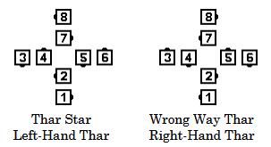

# Thar Family

In the Thar Family, Thars and Wrong Way Thars are formations in
motion. The four Center dancers hold a Pack-saddle Star
and walk backward. In a Pack-Saddle Star, each dancer
turns the palm down and holds the wrist of the dancer ahead, so that all four are linked. Each
Center dancer also holds a forearm grip with the adjacent Outside dancer, who walks forward.

The calls in the Thar Family are some of the oldest. They are
traditionally delivered in a more verbose fashion, blurring the
division between the actual command words and the helping words. As
always, it is the caller’s responsibility to deliver these calls so
the dancers understand what is desired.

Timing numbers in the Thar Family do not count turning the Thar.

>
> 
> 

## Allemande Thar

"Allemande Thar” refers to a Thar Star (Left-Hand Thar) in motion. This definition lists several
command examples that callers use when describing actions that result in a Thar Star in motion.
It also describes how dancers form and turn the Allemande Thar.

### Starting formation
Blended from a Left Arm Turn

### Command examples
#### Walk Around The Corner; Turn Partner Left and Make an Allemande Thar
#### Walk Around Your Corner; Turn Partner Left for an Allemande Thar, Men in the middle of a backup Star
#### Walk Around the Corner; Turn Partner Left a Full Turn, Girls in the middle of an Allemande Thar
#### Do Paso, Turn Partner Left, Corner Right, Partner Left, Boys Swing In to a Thar
#### Boys Make a Right Hand Star, Turn It Once Around, Find Your Corner, Turn Corner Left to an Allemande Thar Star with the Girls in the Center
#### Right And Left Grand, but On your Fourth Hand Make an Allemande Thar, Men back in

### Dance action
Dancers continue to Left Arm Turn 1/2. The Centers form a Right-Hand
Star and back up. Outside dancers hold the Left forearm of a Center
dancer and Walk Forward.

### Ending formation
Thar in motion

### Timing
2 (for the Left Arm Turn 1/2)

### Styling
The dancers in the center, backing up, will form a Pack-Saddle Star.
These Center dancers must remember to allow those on the outside,
who travel farther, to set the pace.
Ladies, if on the outside, may use skirt work.

### Comments
Callers often specify who become center dancers. This is
particularly helpful in non-standard applications.

In most cases, dancers Left Arm Turn 1/2. That is, if the
dancers take forearm holds when shoulder-to-shoulder, the dancer who
begins on the outside will end in the center. Callers may specify a
different amount of turning. For example: Circle Left, Turn Your
Corner Left all the way around to an Allemande Thar, Men in the
Center.

Allemande Thar is part of circle choreography. It is improper
from Left-Hand Waves to call Turn Partner Left to An Allemande Thar.

"Allemande Left to an Allemande Thar" has a specific meaning
described below. It does not mean to Left Arm Turn with Corner
and continue to a Thar. For that action "Allemande Left, hang on to
Corner, Girls Wheel In to an Allemande Thar" could be used.

## Allemande Left to an Allemande Thar

### Starting formation
Same as Allemande Left

### Command examples
#### Allemande Left to an Allemande Thar, go Right and Left and gorm A Star
#### Allemande Left to an Allemande Thar, go Forward Two, Men Swing In to a Backup Star
#### Allemande Left to an Allemande Thar, Go Right and Left and Make an Allemande Thar

### Dance action
Allemande Left; Right Pull By;
Left Arm Turn to make a Thar with the Men in the Center.

### Ending formation
Thar in motion

### Timing
12

### Styling
Same as Allemande Thar

### Comments
To avoid dancer confusion with "Allemande Thar", the
caller must always include some instructions about "Going Gorward".
Simply calling "Allemande Left To An Allemande Thar" is improper.
Furthermore, although going forward two is most common, it must be
specified.

The caller can direct the dancers to Go Forward any number of
hands. Each hand is a Pull By, except the last hand, which is
normally the start of an Arm Turn into a Thar or Wrong Way Thar.

## Wrong Way Thar
"Wrong Way Thar" is a formation shown at the beginning of this Thar Family section.
That formation is also described as a Right-Hand Thar.

The words “Wrong Way Thar” are also the words used to describe a Right-Hand Thar in motion.
This definition lists several command examples that callers use when describing actions that
result in a Wrong Way Thar in motion

### Starting formation
Blended from a Right Arm Turn

### Command examples
#### Allemande Left; Turn Partner Right, Girls Swing In, make a Wrong Way Thar
#### Allemande Left; Turn Partner Right a Full Turn, Boys Swing In, make a Wrong Way Thar
#### Turn Partner Left; Turn Corner Right to a Wrong Way Thar (Men will be in the middle)
#### Do Paso; (after the Do Paso) go to the Corner, Turn by the Right 3/4 to a Wrong Way Thar
#### Allemande Left in the Alamo Style; Swing Thru; Turn by the Right 3/4 To A Wrong Way Thar

### Dance action
Dancers continue to Right Arm Turn 1/2.
The centers form a Left-Hand Star and back up. Outside
dancers hold the right forearm of a center dancer and walk forward.

### Ending formation
Wrong Way Thar in motion

### Timing
2 (for the Right Arm Turn 1/2)

### Styling
Same as Allemande Thar

### Comments
See Allemande Thar.

###### @ Copyright 1997, 2001-2026 by CALLERLAB Inc., The International Association of Square Dance Callers. Permission to reprint, republish, and create derivative works without royalty is hereby granted, provided this notice appears. Publication on the Internet of derivative works without royalty is hereby granted provided this notice appears. Permission to quote parts or all of this document without royalty is hereby granted, provided this notice is included. Information contained herein shall not be changed nor revised in any derivation or publication. 1994, 2000-2020 by CALLERLAB Inc., The International Association of Square Dance Callers. Permission to reprint, republish, and create derivative works without royalty is hereby granted, provided this notice appears. Publication on the Internet of derivative works without royalty is hereby granted provided this notice appears. Permission to quote parts or all of this document without royalty is hereby granted, provided this notice is included. Information contained herein shall not be changed nor revised in any derivation or publication.
