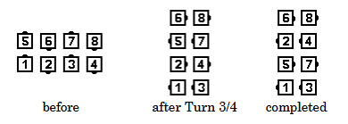

# Three-Quarter Thru

### Starting formations
From any appropriate four-dancer formation where at least some dancers
can execute each part of the call (for example, Right-Hand Box, or Facing Diamond where
Centers are holding right hands), a Thar, or an Alamo Ring

### Dance action
***Those who can Turn 3/4 (270 degrees) by the Right***,
then ***those who can Turn 1/2 (90 degrees) by the Left***.

### Ending formations
A Right-Hand Box ends in a Right-Hand Wave. A Facing Diamond where
Centers are holding right hands ends in a Left-Hand Wave. A Thar Star ends in a Thar Star. A
Wrong Way Thar ends in an Alamo Ring. An Alamo Ring ends in a Wrong Way Thar.

>
> 
>

### Timing
8

### Styling
For all members in this family the styling is the same as for Swing Thru. That is, use
Hands Up throughout the call. The first part of the call blends smoothly into the second part.

### Comments
If there are two adjacent formations each of which can do the call, dancers don’t move
from one to the other. For example: from Right-Hand Columns, each of the two Right-Hand Boxes
does the call independently.

There must be at least one dancer who can do both parts of the call. The call is not proper from
an Inverted Box.

Three-Quarter Thru is defined to begin with a Right Turn. If the caller wants the action to begin
with a Left Turn, then the command to use is “Left Three-Quarter Thru”.

## Left Three-Quarter Thru
***Those who can Turn 3/4 by the Left***,
then ***those who can Turn 1/2 by the Right***.
A Left-Hand Box ends in a Left-Hand Wave.

## From a Thar or Alamo Ring
The Turn 3/4 will either turn the Center Star or change the
formation from one of these to the other. The Turn 1/2 will be danced either in the Alamo Ring,
in each Mini-Wave of the Thar, or by turning the Center Star.

Example: Three-Quarter Thru from a Left-Hand Thar (that is, a Thar Star): Centers Turn the
Star by the Right 3/4; All Turn 1/2 by the Left. Ends in a Left-Hand Thar (that is, a Thar Star).

Example: Left Three-Quarter Thru from an Alamo Ring: All Turn 3/4 by the Left (to make a Thar
Star); Centers Turn the Star (by the Right) 1/2. Ends in a Left-Hand Thar (that is, a Thar Star).

###### @ Copyright 1997, 2001-2026 by CALLERLAB Inc., The International Association of Square Dance Callers. Permission to reprint, republish, and create derivative works without royalty is hereby granted, provided this notice appears. Publication on the Internet of derivative works without royalty is hereby granted provided this notice appears. Permission to quote parts or all of this document without royalty is hereby granted, provided this notice is included. Information contained herein shall not be changed nor revised in any derivation or publication. 1997, 2001-2025 by CALLERLAB Inc., The International Association of Square Dance Callers. Permission to reprint, republish, and create derivative works without royalty is hereby granted, provided this notice appears. Publication on the Internet of derivative works without royalty is hereby granted provided this notice appears. Permission to quote parts or all of this document without royalty is hereby granted, provided this notice is included. Information contained herein shall not be changed nor revised in any derivation or publication.

<!-- Parts
34Thru1
34Thru2
Left34Thru1
Left34Thru2
-->