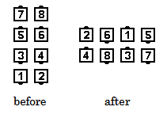

# Track 2

### Starting formation:
Completed Double Pass Thru. 

### Dance action
The dancers work in "Tandem", that is, the Trailing dancers follow the Lead
dancers. Those in the right "track" move single file to the left,
counterclockwise, staying to the inside of the dancers on the left "track", who
move single file, clockwise, to the right on the outside.
The movement continues as in a
[Double Pass Thru](../ms/double_pass_thru.md), 
until the dancers have reached Parallel Right-Hand Ocean Waves. 

### Ending formation
Parallel Right-Hand Ocean Waves

>
> 
>

### Timing
8

### Styling
As dancers are moving simultaneously in opposing directions,
it is important for them to provide moving room for one another.
Those on the outside must avoid crowding those in the center
All dancers hold arms in  natural dance position, blending into
a  hands-up Ocean Wave formation at the conclusion of the call.

## Left Track 2 
Those in the left “track” stay to the inside of those on the right “track”.
The ending formation is Parallel Left-Hand Ocean Waves.

###### @ Copyright 1997, 2001-2026 by CALLERLAB Inc., The International Association of Square Dance Callers. Permission to reprint, republish, and create derivative works without royalty is hereby granted, provided this notice appears. Publication on the Internet of derivative works without royalty is hereby granted provided this notice appears. Permission to quote parts or all of this document without royalty is hereby granted, provided this notice is included. Information contained herein shall not be changed nor revised in any derivation or publication. 1997, 2001-2025 by CALLERLAB Inc., The International Association of Square Dance Callers. Permission to reprint, republish, and create derivative works without royalty is hereby granted, provided this notice appears. Publication on the Internet of derivative works without royalty is hereby granted provided this notice appears. Permission to quote parts or all of this document without royalty is hereby granted, provided this notice is included. Information contained herein shall not be changed nor revised in any derivation or publication.
