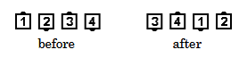

# Trade the Wave

### Starting formation:
Four-Dancer Ocean Wave. 

### Dance action
Dancers facing the same direction in the Wave
[Trade](../ms/trade.md) with each other.

### Ending formation
A Right-Hand Ocean Wave ends in a Left-Hand Ocean Wave.
A Left-Hand Ocean Wave ends in a Right-Hand Ocean Wave.
End dancers become Center dancers and Center
dancers become End dancers.

>
> 
>

### Timing
6

### Styling
As in any Trade, dancers first step slightly forward
to clear the Wave before turning toward dancer
with whom they are trading.
Assume hands up position in Ocean Wave styling.

### Comment
In accordance with the definition of Trade,
the two dancers facing in the same
direction pass right shoulders as they Trade.

###### @ Copyright 1997, 2001-2026 by CALLERLAB Inc., The International Association of Square Dance Callers. Permission to reprint, republish, and create derivative works without royalty is hereby granted, provided this notice appears. Publication on the Internet of derivative works without royalty is hereby granted provided this notice appears. Permission to quote parts or all of this document without royalty is hereby granted, provided this notice is included. Information contained herein shall not be changed nor revised in any derivation or publication. 1997, 2001-2025 by CALLERLAB Inc., The International Association of Square Dance Callers. Permission to reprint, republish, and create derivative works without royalty is hereby granted, provided this notice appears. Publication on the Internet of derivative works without royalty is hereby granted provided this notice appears. Permission to quote parts or all of this document without royalty is hereby granted, provided this notice is included. Information contained herein shall not be changed nor revised in any derivation or publication.
