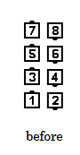
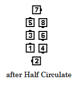
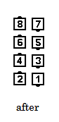

# Triple Scoot

### Starting formations
Right-Hand or Left-Hand Columns

### Dance action
The #1 dancers Column Circulate while all others
1/2 Column Circulate (“Grand Extend”),
Arm Turn 1/2, and step forward (“Grand Extend”).

### Ending formations
Columns of the same handedness as at the start.

>
> 
> 
> 
>

### Timing
6

### Comments
Most dancers will use the same hand three times: to form the starting Column, to do the Arm
Turn, and to form the ending Column.

**Double Scoot** is used when there are 6 active dancers in Columns of 3

###### @ Copyright 1997, 2001-2026 by CALLERLAB Inc., The International Association of Square Dance Callers. Permission to reprint, republish, and create derivative works without royalty is hereby granted, provided this notice appears. Publication on the Internet of derivative works without royalty is hereby granted provided this notice appears. Permission to quote parts or all of this document without royalty is hereby granted, provided this notice is included. Information contained herein shall not be changed nor revised in any derivation or publication. 1982, 1986-1988, 1995, 2001-2020. Bill Davis, John Sybalsky, and CALLERLAB Inc., The International Association of Square Dance Callers. Permission to reprint, republish, and create derivative works without royalty is hereby granted, provided this notice appears. Publication on the Internet of derivative works without royalty is hereby granted provided this notice appears. Permission to quote parts or all of this document without royalty is hereby granted, provided this notice is included. Information contained herein shall not be changed nor revised in any derivation or publication.
