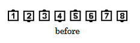
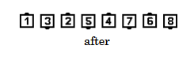

# Triple Trade

### Starting formations
Tidal Wave, Tidal Two-Faced Line, Point-to-Point Diamonds, Six-Dancer
Ocean Wave, or any 3 Pairs of Adjacent Dancers.

### Dance action
The two End dancers remain in place as the three adjacent Pairs of dancers (the
six in the center) Trade with each other.

### Ending formations
Tidal Waves and Tidal Two-Faced Lines end in the same formation as they
started and with the same handedness.

>
> 
> 
> 

Timing: 4

###### @ Copyright 1997, 2001-2026 by CALLERLAB Inc., The International Association of Square Dance Callers. Permission to reprint, republish, and create derivative works without royalty is hereby granted, provided this notice appears. Publication on the Internet of derivative works without royalty is hereby granted provided this notice appears. Permission to quote parts or all of this document without royalty is hereby granted, provided this notice is included. Information contained herein shall not be changed nor revised in any derivation or publication. 1982, 1986-1988, 1995, 2001-2025. Bill Davis, John Sybalsky, and CALLERLAB Inc., The International Association of Square Dance Callers. Permission to reprint, republish, and create derivative works without royalty is hereby granted, provided this notice appears. Publication on the Internet of derivative works without royalty is hereby granted provided this notice appears. Permission to quote parts or all of this document without royalty is hereby granted, provided this notice is included. Information contained herein shall not be changed nor revised in any derivation or publication.
