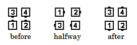

# Turn Thru

### Starting formation
Facing Dancers

### Command examples
#### Turn Thru
#### Swing Thru; Turn Thru
#### Girls Turn Thru
#### Squared set: Heads Turn Thru and Separate Around 1 to a Line
#### Heads Square Thru 4; Spin The Top; Turn Thru; Courtesy Turn

### Dance action
In one smooth motion, dancers Step To A Wave
(but use forearm styling), Right Arm Turn 1/2, and Step Thru.

### Ending formation
Back-To-Back Dancers

Turn Thru is defined to begin with a Right Arm Turn.
If the caller wants the action to begin with
a Left Arm Turn, then the command to use is “Left Turn Thru”.

>
> 
> 

### Timing
4

**Left Turn Thru**: In one smooth motion,
dancers Step to a Left-Hand Wave (but use forearm
styling), Left Arm Turn 1/2, and Step Thru ending as Back-to-Back Dancers.

### Styling
Similar to Allemande Left. Use normal forearm position.
Men's free hand in natural dance
position. Lady's skirt work desirable for free hand.

### Comments
The [Ocean Wave Rule](../ms/ocean_wave_rule.md) applies to this call.

Turn Thru is always a 180-degree turn.
From an Alamo Ring, if the desired action is to get everyone
to their Corners, the proper call would be an Arm Turn, not a Turn Thru.

###### @ Copyright 1997, 2001-2026 by CALLERLAB Inc., The International Association of Square Dance Callers. Permission to reprint, republish, and create derivative works without royalty is hereby granted, provided this notice appears. Publication on the Internet of derivative works without royalty is hereby granted provided this notice appears. Permission to quote parts or all of this document without royalty is hereby granted, provided this notice is included. Information contained herein shall not be changed nor revised in any derivation or publication. 1994, 2000-2020 by CALLERLAB Inc., The International Association of Square Dance Callers. Permission to reprint, republish, and create derivative works without royalty is hereby granted, provided this notice appears. Publication on the Internet of derivative works without royalty is hereby granted provided this notice appears. Permission to quote parts or all of this document without royalty is hereby granted, provided this notice is included. Information contained herein shall not be changed nor revised in any derivation or publication.
