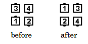
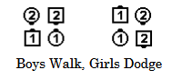

# Walk and Dodge

### Starting formations
Box Circulate, Facing Couples

### Command Examples
#### Walk and Dodge
#### Right and Left Thru, Girls Walk, Boys Dodge (from Facing Normal Couples)

### Dance Action
Some dancers move forward (“Walk”) to take the position of the dancer in front of
them, and other dancers, without changing facing direction, move sideways (“Dodge”) into the
adjacent spot.

From a Right-Hand or Left-Hand Box, Trailers “Walk” and Leaders “Dodge”.
From Facing Couples, callers must designate which dancers “Walk” and which dancers “Dodge”.

### Ending Formation
Back-To-Back Couples, Right-Hand Box or Left-Hand Box

>
> 
> 
>

### Timing
4

### Styling
Arms in natural dance position, with dancers forming a Couple or
Mini-Wave handhold at the end of the call.

### Comments
Walk and Dodge is a four-dancer call. From Right-Hand or Left-Hand Columns,
dancers work in two groups of four, one on each side, ending in a Trade By formation.

It is mandatory from Facing Couples to designate two of the dancers to Walk forward while the
other two dancers Dodge. For example, “Girls Walk, Boys Dodge” or “Original Heads Walk, others
Dodge”. The result will be either a Right-Hand Box or a Left-Hand Box.

As a gimmick, callers may designate some dancers to back up rather than “Walking”. For
example, Heads Square Thru, Touch a Quarter, Walk and Dodge, Girls Back Up and Boys Dodge.
From Lines Facing Out, the command Centers Walk, Ends Dodge is also a gimmick, as are other
applications where dancers leave their group of four. (See “Additional Details: Commands:
Gimmicks”.)

There are extended applications in which six or eight dancers work together. For example, after
Sides Pass the Ocean, Sides Swing Thru, All Boys Run, it is possible to either have the Center
Six Walk and Dodge or the Outside Six Walk and Dodge. In both cases, four dancers “Walk” and
two dancers “Dodge”. It is also possible to have six dancers “Walk” and two dancers “Dodge”. For
example, Heads Touch a Quarter, Side Girls Dodge and Others Walk.

From Facing Couples or Back-to-Back Couples, the command “Walk and Dodge” by itself is
improper unless dancers are expected to Do Their Part. (See “Additional Details: Commands: Do
Your Part”.)

###### @ Copyright 1997, 2001-2026 by CALLERLAB Inc., The International Association of Square Dance Callers. Permission to reprint, republish, and create derivative works without royalty is hereby granted, provided this notice appears. Publication on the Internet of derivative works without royalty is hereby granted provided this notice appears. Permission to quote parts or all of this document without royalty is hereby granted, provided this notice is included. Information contained herein shall not be changed nor revised in any derivation or publication. 1997, 2001-2026 by CALLERLAB Inc., The International Association of Square Dance Callers. Permission to reprint, republish, and create derivative works without royalty is hereby granted, provided this notice appears. Publication on the Internet of derivative works without royalty is hereby granted provided this notice appears. Permission to quote parts or all of this document without royalty is hereby granted, provided this notice is included. Information contained herein shall not be changed nor revised in any derivation or publication.
